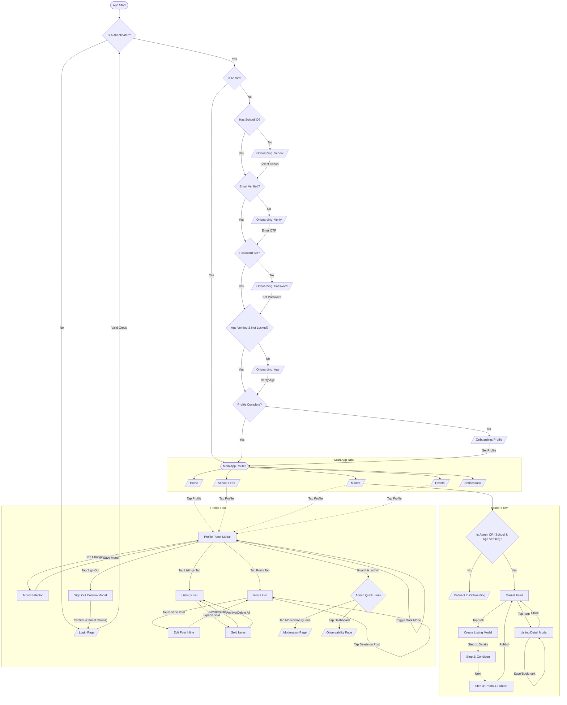

# User Journey & Auth Flow

The following Mermaid diagram outlines the authentication guards, onboarding journey, and inner flows for Market and Profile.

```mermaid
graph TD
    %% Main Onboarding and Auth Flow
    Start(["App Start"]) --> CheckAuth{"Is Authenticated?"}
    
    CheckAuth -- "No" --> Login[/"Login Page"/]
    CheckAuth -- "Yes" --> CheckAdmin{"Is Admin?"}
    
    Login -- "Valid Creds" --> CheckAuth
    
    %% Admin Bypass
    CheckAdmin -- "Yes" --> MainApp(["Main App Router"])
    CheckAdmin -- "No" --> CheckSchool{"Has School ID?"}
    
    %% Onboarding Sequence
    CheckSchool -- "No" --> OnbSchool[/"Onboarding: School"/]
    CheckSchool -- "Yes" --> CheckVerify{"Email Verified?"}
    OnbSchool -- "Select School" --> CheckVerify
    
    CheckVerify -- "No" --> OnbVerify[/"Onboarding: Verify"/]
    CheckVerify -- "Yes" --> CheckPass{"Password Set?"}
    OnbVerify -- "Enter OTP" --> CheckPass
    
    CheckPass -- "No" --> OnbPass[/"Onboarding: Password"/]
    CheckPass -- "Yes" --> CheckAge{"Age Verified & Not Locked?"}
    OnbPass -- "Set Password" --> CheckAge
    
    CheckAge -- "No" --> OnbAge[/"Onboarding: Age"/]
    CheckAge -- "Yes" --> CheckProfile{"Profile Complete?"}
    OnbAge -- "Verify Age" --> CheckProfile
    
    CheckProfile -- "No" --> OnbProfile[/"Onboarding: Profile"/]
    CheckProfile -- "Yes" --> MainApp
    OnbProfile -- "Set Profile" --> MainApp
    
    %% Main Tabs
    subgraph Main App Tabs
        MainApp --> Home[/"Home"/]
        MainApp --> SchoolFeed[/"School Feed"/]
        MainApp --> MarketTab[/"Market"/]
        MainApp --> Events[/"Events"/]
        MainApp --> Notifications[/"Notifications"/]
    end
    
    %% Cross-cutting Profile Access (Usually triggered via TopBar or SchoolTopBar)
    Home -. "Tap Profile" .-> ProfilePanel
    SchoolFeed -. "Tap Profile" .-> ProfilePanel
    MarketTab -. "Tap Profile" .-> ProfilePanel
    Events -. "Tap Profile" .-> ProfilePanel
    
    %% Market Flow Subchart
    subgraph Market Flow
        MarketTab --> MktGuard{"Is Admin OR (School & Age Verified)?"}
        MktGuard -- "No" --> RootOnb[/"Redirect to Onboarding"/]
        MktGuard -- "Yes" --> MarketFeed["Market Feed"]
        
        MarketFeed -- "Tap Sell" --> CreateModal["Create Listing Modal"]
        CreateModal -- "Step 1: Details" --> CreateStep2["Step 2: Condition"]
        CreateStep2 -- "Next" --> CreateStep3["Step 3: Photo & Publish"]
        CreateStep3 -- "Publish" --> MarketFeed
        
        MarketFeed -- "Tap Item" --> DetailModal["Listing Detail Modal"]
        DetailModal -- "Close" --> MarketFeed
        DetailModal -- "Save/Bookmark" --> DetailModal
    end
    
    %% Profile Flow Subchart
    subgraph Profile Flow
        ProfilePanel["Profile Panel Modal"]
        
        ProfilePanel -- "Tap Change Mood" --> MoodEdit["Mood Selector"]
        MoodEdit -- "Save Mood" --> ProfilePanel
        
        ProfilePanel -- "Tap Posts Tab" --> PostsTab["Posts List"]
        PostsTab -- "Tap Edit on Post" --> EditPost["Edit Post Inline"]
        EditPost -- "Save/Cancel" --> PostsTab
        PostsTab -- "Tap Delete on Post" --> PostsTab
        
        ProfilePanel -- "Tap Listings Tab" --> ListingsTab["Listings List"]
        ListingsTab -- "Expand Sold" --> SoldListings["Sold Items"]
        SoldListings -- "Relist Item" --> ListingsTab
        SoldListings -- "Archive/Delete All" --> ListingsTab
        
        ProfilePanel -- "Guard: is_admin" --> AdminOps{"Admin Quick Links"}
        AdminOps -- "Tap Moderation Queue" --> ModPage[/"Moderation Page"/]
        AdminOps -- "Tap Dashboard" --> ObsPage[/"Observability Page"/]
        
        ProfilePanel -- "Toggle Dark Mode" --> ProfilePanel
        
        ProfilePanel -- "Tap Sign Out" --> SignOutConfirm["Sign Out Confirm Modal"]
        SignOutConfirm -- "Confirm (Cancel returns)" --> Login
    end
```
